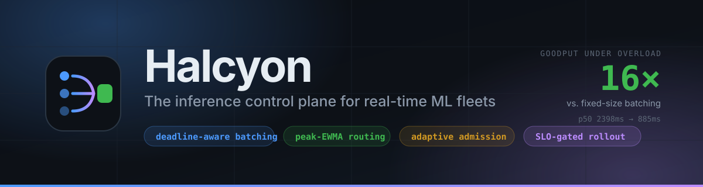
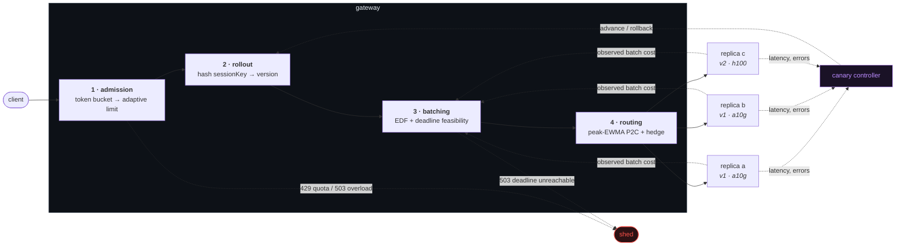

<p align="center">
  
</p>

<p align="center">
  <a href="#quickstart"></a>
  <a href="#the-numbers"></a>
  
  
  <a href="./LICENSE"></a>
</p>

<p align="center">
  <b><a href="#the-problem">Problem</a></b> ·
  <b><a href="#how-it-works">How it works</a></b> ·
  <b><a href="#the-numbers">Benchmarks</a></b> ·
  <b><a href="#quickstart">Quickstart</a></b> ·
  <b><a href="#architecture">Architecture</a></b> ·
  <b><a href="#design-decisions">Decisions</a></b>
</p>

---

## The problem

GPUs are the most expensive compute you will ever rent, and almost nobody uses them well.

Inference service time is **affine**, not linear, in batch size: a fixed kernel-launch and
weight-paging cost, plus a marginal per-token cost. On a typical 8B-parameter decoder that is
roughly `18ms + 0.022ms × tokens`. Serve one request at a time and a 200-token completion burns
**80% of its GPU time on overhead you paid for and threw away**.

So you batch. And immediately hit the wall every inference platform hits:

> Waiting to fill a batch recovers throughput but adds queueing delay.
> A fixed batch size stalls forever under light traffic.
> A fixed timeout is a number that is correct at exactly one arrival rate and wrong at every other.

Then the harder problems arrive. Your replicas are not identical — different hardware
generations, different KV-cache residency, noisy neighbours. One of them starts OOM-ing and
fails in 2ms, so your latency-aware load balancer sends it _more_ traffic. Traffic doubles and
your static concurrency cap is suddenly either throttling a healthy fleet or letting queues
grow until every request times out. And you still need to ship a new model version without
betting the entire user base on it.

**Halcyon is a control plane that treats all four as one scheduling problem.**

|               | Naive approach                   | What Halcyon does                                                                                                                                         |
| ------------- | -------------------------------- | --------------------------------------------------------------------------------------------------------------------------------------------------------- |
| **Batching**  | Fixed size, or a tuned timeout   | Earliest-deadline-first with an online cost model. Batch size is _emergent_, and requests that provably cannot be served in time are shed in microseconds |
| **Routing**   | Round-robin or least-connections | Peak-EWMA scoring under power-of-two-choices, with outcome-based circuit breaking and p95-triggered hedging                                               |
| **Admission** | Static concurrency cap           | Gradient-based adaptive limiter that infers queueing from latency, plus per-tenant token buckets and priority-graded shedding                             |
| **Rollout**   | Deploy and watch a dashboard     | Sticky-hash traffic splitting with an SLO-gated canary controller that promotes or rolls back on evidence                                                 |

---

## The numbers

Measured with a **fully seeded, reproducible discrete-event simulation** — same arrival trace,
same device model, three schedulers. Run it yourself: `npm run bench`.

Workload: Poisson arrivals, log-normal request sizes, mixed SLOs (30% urgent at 120ms, 70%
relaxed at 900ms), single accelerator at `18ms + 0.022ms/token`, 120s simulated.

**Goodput** counts only requests completed _within their deadline_, as a share of requests
**offered** — so a scheduler cannot score well by refusing hard work.

### At saturation — 200 req/s

| strategy                | goodput/s |       p50 |       p95 | urgent SLO |  util |
| ----------------------- | --------: | --------: | --------: | ---------: | ----: |
| no batching             |       0.3 |   11544ms |   11736ms |       0.0% |  100% |
| fixed batch (32 / 25ms) |     155.7 |     158ms |     300ms |      27.9% | 99.5% |
| **halcyon**             | **163.6** | **130ms** | **237ms** |  **41.0%** | 99.3% |

### Past saturation — 260 req/s, against a ~219 req/s ceiling

| strategy                |          goodput/s |       p50 |        p95 | relaxed SLO |
| ----------------------- | -----------------: | --------: | ---------: | ----------: |
| no batching             |                0.3 |   11576ms |    11704ms |        0.1% |
| fixed batch (32 / 25ms) |                5.2 |    2398ms |     2618ms |        2.8% |
| **halcyon**             | **83.1** ⟶ **16×** | **885ms** | **1020ms** |   **45.1%** |

Nothing can serve this trace in full. The only question is _which requests a scheduler
sacrifices_ — and a scheduler that admits work it cannot finish sacrifices all of them.

> **Below saturation, Halcyon and fixed batching are indistinguishable.** That is the honest
> result, and it is reported here rather than hidden: deadline-awareness earns nothing when
> there is slack for everyone. It earns everything at the edge, which is where systems break.

### Verified on a live fleet, not just in simulation

```
$ node scripts/loadtest.mjs --clients 32 --seconds 20
  requests        4706       success rate    100.00%
  throughput      233.8 req/s
  p50/p95/p99     128 / 185 / 235 ms
  mean batch size 12.44

$ node scripts/verify-rollout.mjs
  [2s]  progressing at 25%      25%  -> advance   | baseline p95 168ms, canary p95 63ms
  [6s]  progressing at 100%     100% -> promote   | baseline p95  71ms, canary p95 75ms
  PASS: rollout promoted and v2 now serves 100% of traffic.
```

Both run in CI on every push, against a real fleet — not as illustrations.

---

## Quickstart

```bash
git clone https://github.com/NavyashreeNS/halcyon.git
cd halcyon
npm install
npm run build

# Gateway + a deliberately heterogeneous fleet (one fast replica, one 0.6x straggler,
# one on a second model version). Identical replicas make any load balancer look good.
node scripts/dev-stack.mjs --canary
```

Then, in another terminal:

```bash
# Send one request
curl -s localhost:8080/v1/infer \
  -H 'x-api-key: demo-key-premium' -H 'content-type: application/json' \
  -d '{"model":"llama-3-8b","input":"hello","deadlineMs":2000,"maxOutputTokens":64}' | jq

# Drive real load
node scripts/loadtest.mjs --clients 32 --seconds 20

# Start a canary and watch it promote itself on measured evidence
node scripts/verify-rollout.mjs
```

|                |                                                                                          |
| -------------- | ---------------------------------------------------------------------------------------- |
| **Dashboard**  | `npm run dev --workspace @halcyon/web` → http://localhost:3000                           |
| **Live state** | http://localhost:8080/v1/control/state                                                   |
| **Prometheus** | http://localhost:8080/metrics                                                            |
| **Benchmark**  | `npm run bench`                                                                          |
| **Full stack** | `npm run stack:up` (Postgres, gateway, 3 workers, dashboard, Prometheus, OTel collector) |

The response tells you what the scheduler decided, not just what the model said:

```json
{
  "version": "v1",
  "replicaId": "replica-b",
  "hedged": false,
  "timings": { "queuedMs": 4, "executionMs": 118, "totalMs": 122 },
  "batch": { "size": 17, "reason": "deadline" }
}
```

`"reason": "deadline"` means this batch was flushed early because waiting one more millisecond
would have breached someone's SLO. That is the scheduler explaining itself.

---

## How it works

A request passes through four decisions, in an order that is not arbitrary.



**Admission is first** because every later step costs real resources, and a rejected request
should cost none. **Version resolution precedes batching** because requests for different
versions cannot share a batch — they are different weights on different replicas. **Routing
comes last** because the load estimate needs to know how big the batch is.

<details>
<summary><b>1 · Deadline-aware continuous batching</b> — <code>packages/core/src/batching/</code></summary>

<br>

Requests carry an absolute deadline and are ordered earliest-deadline-first. On every arrival
and timer expiry the scheduler asks one question:

```
slack = earliestDeadline − now − predictedCost(queuedTokens) − safetyMargin − inFlightWork
```

Positive slack, the batch keeps growing. Non-positive, flush now — however small the batch.
A `lingerMs` ceiling bounds waiting when every deadline is generous.

`predictedCost` comes from a **recursive least-squares fit with exponential forgetting** of
`serviceTime ≈ intercept + slope × tokens`, updated from every executed batch. Forgetting
matters: the same model behaves differently after a driver upgrade or a co-tenant landing on
the device, and a fit with unbounded memory takes hours to notice.

Two lanes — interactive and bulk — keep a nightly embedding backfill from competing with a
user-facing completion, with bulk work aged into the fast lane so it cannot starve.

**The part that produces the 16×:** because the scheduler can estimate cost, it can also prove
when a request is _infeasible_ — accounting for work queued ahead of it under EDF **and** work
already dispatched to a device. Those requests are rejected in microseconds instead of
consuming a GPU slot and returning a response nobody is still waiting for.

</details>

<details>
<summary><b>2 · Peak-EWMA routing under power-of-two-choices</b> — <code>packages/core/src/routing/</code></summary>

<br>

```
score = (inflight + 1) × ewmaLatency / weight
```

An estimate of the queueing delay a new request would face — Little's Law, per replica. The
router samples **two** candidates at random and takes the better one.

Why not just pick the global minimum? Because every gateway instance would independently
compute the same "best" replica and stampede it together, then stampede the next one. Two
random choices provably reduces maximum load from Θ(log n / log log n) to Θ(log log n) _and_ is
immune to that resonance.

The EWMA decays by **elapsed time**, not sample count — a plain EWMA freezes at its last
reading when a replica stops receiving traffic, making a shunned replica look permanently
excellent.

Health is judged on **outcomes**, not timing, by a per-replica circuit breaker with exponential
re-open backoff. This closes the black-hole failure mode: a replica failing in 2ms looks _fast_
to a latency-based balancer, which then sends it more traffic.

Hedging fires at the fleet p95, bounding extra load at ~5% while racing only requests already
behaving abnormally. The loser is aborted so it stops occupying an accelerator.

</details>

<details>
<summary><b>3 · Adaptive admission control</b> — <code>packages/core/src/admission/</code></summary>

<br>

You cannot know the right concurrency limit. It changes with model version, hardware, batch
composition and neighbours — a number tuned in March is fiction by June.

So don't try. Detect **queueing** instead, which has an unmistakable signature: short-window
latency rising above long-window latency.

```
g      = clamp(longRTT / shortRTT, 0.5, 1.0)     // < 1 exactly when a queue forms
target = limit × g + √limit                       // multiplicative decrease, sublinear increase
```

Same family of controller as TCP congestion control, for the same reason: neither endpoint can
observe the bottleneck directly, so both infer it from delay.

Failed requests release their slot but are **excluded from the RTT estimate** — a fast failure
otherwise reads as a latency improvement and would make the limiter _raise_ the limit on a
system that is falling over.

Per-tenant token buckets run _before_ the fleet limit, so one customer's runaway retry loop is
attributed to that customer instead of triggering fleet-wide shedding that punishes everyone
else. Every `Retry-After` is computed from the actual refill time.

</details>

<details>
<summary><b>4 · SLO-gated progressive rollout</b> — <code>packages/core/src/rollout/</code></summary>

<br>

Traffic is assigned by **hashing a stable key** (session, user, conversation), not by a coin
flip. Random assignment sends one user's requests to different model versions mid-conversation
and turns every per-session metric into a blend of both arms — destroying the comparison the
canary exists to make. Hashing gives stickiness with _no shared state between gateways_.

The canary is compared against the baseline **running concurrently on the same fleet**, never
against history, which would confound the version change with time of day and traffic mix.

Three guards, each earning its place:

- **Minimum request count** — at 1% traffic a window may hold eight requests; two failures read
  as a 25% error rate.
- **Relative _and_ absolute error tolerance** — against a flawless baseline, any error at all is
  an infinite relative regression.
- **Consecutive streaks in both directions** — one bad window is a blip, _n_ in a row is a trend.

A data-sparse window touches **neither** streak: resetting the healthy one stalls low-traffic
rollouts forever, resetting the unhealthy one lets a real regression hide behind quiet periods.

</details>

---

## Architecture

```
halcyon/
├── packages/
│   ├── core/          ← the algorithms. pure, dependency-free, clock-injectable
│   │   ├── batching/    deadline-aware batcher + online cost model
│   │   ├── routing/     peak-EWMA P2C router + circuit breaker
│   │   ├── admission/   token bucket + gradient-based adaptive limiter
│   │   ├── rollout/     sticky traffic splitter + canary controller
│   │   ├── stats/       HDR-style latency histogram, time-decayed EWMA
│   │   ├── test/        103 deterministic tests — no sleeps, no I/O
│   │   └── bench/       seeded discrete-event simulation
│   ├── contracts/     Zod schemas — one definition, enforced at runtime and compile time
│   ├── telemetry/     Prometheus registry + W3C trace context + OTLP exporter
│   └── db/            Drizzle schema, migrations, typed queries
├── apps/
│   ├── gateway/       Fastify. composes the four algorithms into a request path
│   ├── worker/        model replica with a pluggable runtime interface
│   └── web/           Next.js 15 control-plane dashboard
├── infra/
│   ├── docker/        multi-stage images, compose stack, Prometheus rules, OTel config
│   ├── k8s/           Deployment + StatefulSet + HPA + PDB, hardened pod security
│   └── terraform/     VPC, RDS, ECR — the slow-moving layer only
└── docs/adr/          why each decision was made, and what it cost
```

**`packages/core` has no dependencies and performs no I/O.** No `Date.now()`, no globals — every
time-dependent component takes an injectable `Clock`. That single constraint is why the entire
scheduling and rollout surface is tested deterministically in under three seconds, and why the
same code runs unchanged inside the gateway, inside a worker, or inside the simulation harness.

### Engineering practices

- **Strict TypeScript** everywhere — `noUncheckedIndexedAccess`, `exactOptionalPropertyTypes`,
  `verbatimModuleSyntax`. No `any`, no non-null assertions on external data.
- **Deterministic tests.** Injectable clocks and seeded PRNGs. No `sleep()`, no flakes.
- **Reproducible benchmarks.** The simulation is fully seeded, so a change in the output is a
  change in behaviour rather than machine noise. CI posts it to the job summary.
- **CI that can actually fail** — format, typecheck, 157 tests, the benchmark, a real
  end-to-end load test against a booted fleet, an automated canary rollout verification, and a
  three-service Docker build matrix.
- **Metrics with bounded cardinality.** Every label has a small domain. Histogram _buckets_ are
  exported, not pre-computed quantiles, because buckets aggregate across instances and
  quantiles do not.
- **Security defaults**: non-root containers, read-only root filesystems, all capabilities
  dropped, SHA-256 + constant-time API-key comparison, no secrets in Terraform outputs.

---

## Design decisions

Each ADR records the alternatives considered and what the decision cost — including the bugs it
caused.

|                                                  | Decision                   | The interesting part                                                                                                                                                                           |
| ------------------------------------------------ | -------------------------- | ---------------------------------------------------------------------------------------------------------------------------------------------------------------------------------------------- |
| [0001](docs/adr/0001-deadline-aware-batching.md) | Deadline-aware batching    | Independently clamping the cost model's slope and intercept inflated the intercept to 6.9s, and the scheduler correctly rejected 4,889 servable requests. Fixed with constrained least squares |
| [0002](docs/adr/0002-peak-ewma-routing.md)       | Peak-EWMA P2C routing      | Using the circuit breaker's `tryAcquire` as an eligibility filter leaked half-open probe slots to replicas that were never chosen, making recovery impossible                                  |
| [0003](docs/adr/0003-adaptive-concurrency.md)    | Adaptive concurrency       | Why fast failures must be excluded from the latency estimate, and why quota checks precede the fleet limit                                                                                     |
| [0004](docs/adr/0004-sticky-canary-rollouts.md)  | Sticky canary rollouts     | Why `Math.random() < weight` is a correctness bug, not a style choice                                                                                                                          |
| [0005](docs/adr/0005-state-placement.md)         | In-memory scheduling state | Instances disagreeing is the design, not a compromise — P2C _requires_ it                                                                                                                      |

### Four bugs worth reading about

Each was found by running the system rather than by reading it, and each is now pinned by a
regression test.

0. **A queue requests could disappear into.** With every replica draining there was nowhere to
   dispatch, so the batcher held its contents — forever. The caller's connection stayed open
   long past any useful answer. A scheduler that reasons about deadlines must also _enforce_
   them on its own queue: queued work is now evicted the moment its deadline passes, and the
   client gets an explicit `deadline_unreachable` instead of a hang.

1. **A busy-spin at saturation.** As load approaches capacity, deadline slack converges to zero
   _from above_. The scheduler armed a timer 0.4ms out, woke, recomputed an equally tiny slack,
   and re-armed — burning the event loop precisely when it was scarcest. No runtime honours a
   sub-millisecond timer anyway, so slack below one tick is slack that cannot be spent.

2. **`Promise.race` in the hedge path.** Race settles on the first promise to settle —
   _including one that rejects_. A hedge failing fast against a busy replica killed batches
   whose primary was running perfectly. Exactly the failure hedging exists to prevent. The
   semantics needed are `Promise.any`: succeed if any attempt succeeds, fail only if all do.

3. **Scoring is not exclusion.** Peak-EWMA makes a busy replica _less attractive_, but a worker
   that accepts one batch at a time needs it to be _ineligible_ — a slow-enough replica could
   still win the comparison while already occupied. 2.7% of requests failed on arrival until
   the router gained a hard per-replica concurrency ceiling.

---

## API

| Method | Path                                             | Purpose                                                                  |
| ------ | ------------------------------------------------ | ------------------------------------------------------------------------ |
| `POST` | `/v1/infer`                                      | Submit inference. Returns the scheduler's decisions alongside the output |
| `POST` | `/v1/workers/register`                           | Replica registration                                                     |
| `POST` | `/v1/workers/:id/heartbeat` · `/drain`           | Liveness and graceful removal                                            |
| `GET`  | `/v1/control/state`                              | Complete control-plane state in one round trip                           |
| `POST` | `/v1/control/rollouts`                           | Begin a progressive rollout                                              |
| `POST` | `/v1/control/rollouts/:model/promote` · `/abort` | Operator override                                                        |
| `GET`  | `/v1/control/rollouts/:model/history`            | Every canary decision with the metrics behind it                         |
| `GET`  | `/healthz` · `/readyz` · `/metrics`              | Liveness, readiness, Prometheus                                          |

Rejections are typed and actionable — `quota_exceeded`, `overloaded`, `deadline_unreachable`,
`queue_full` — each with a computed `Retry-After`. A client can tell "you are over quota" from
"the fleet cannot meet your deadline right now", and respond differently.

---

## Scope

Built as a systems-engineering project, and honest about its edges:

- The model runtime is **simulated** — a calibrated device model behind a `ModelRuntime`
  interface, not a real GPU. Swapping in vLLM or TensorRT-LLM means writing one adapter; the
  interface exists so that substitution touches nothing else. The simulation is deliberate: it
  makes the whole system runnable on a laptop and lets failure modes be _injected_ rather than
  waited for.
- Benchmark figures come from a **seeded simulation** with an explicit device model, stated
  above so they can be reproduced or disputed. The live-fleet numbers are from real HTTP against
  real processes.
- Per-tenant quotas are **per-instance**, so _n_ gateways allow *n*× burst. Deliberate, and
  explained in ADR 0005 — quotas are fairness, the adaptive limiter is protection.

## License

Apache 2.0 — see [LICENSE](./LICENSE).
